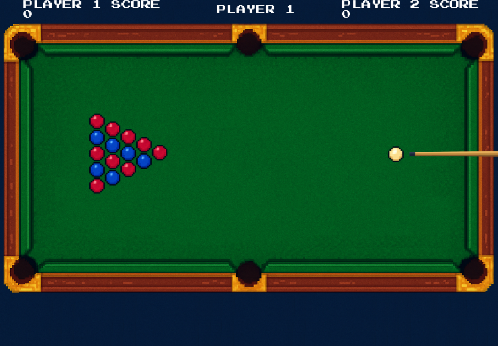

# 🎱 **Magic Snooker 2D** 🧙‍♂️  

## 📝 **Descrição**  

*Magic Snooker 2D* é um jogo de sinuca em 2D com um toque mágico! 💫 Combinando as regras clássicas da sinuca com um sistema de magias estratégicas.

A ideia central gira em torno de transformar a sinuca tradicional em um jogo mais dinâmico, 
onde decisões rápidas e o uso inteligente de habilidades especiais podem virar o jogo a 
qualquer momento. Queremos que os jogadores sintam a empolgação de uma partida 
disputada, com momentos de tensão ao decidir quando usar uma magia e a satisfação de ver 
uma estratégia bem-sucedida. 

🎯 **Objetivo**: Encaçapar todas as bolas do seu grupo ( vermelhas ou azuis ) para vencer. 

🪄 **Magias Especiais**: A cada 2 bolas encaçapadas seguidas, você ganha direito a usar uma magia:
1. ⚡ Acelerar a barra de força do oponente
2. 🎯 Reduzir a bola branca adversária

> [!NOTE]  
> 🔨 Trabalho de Progresso 🚧
>
> As magias serão implementadas na versão final do Magic Snooker 2D. Nesta entrega focamos em desenvolver os conceitos básicos de uma sinuca.
>
> Nesta primeira etapa foi implementado toda a física do jogo e parte das regras base da sinuca, regras essas que foram adaptadas para deixar o jogo mais simples, como o uso de bolas vermelhas e azuis no lugar das bolas enumeradas.

---
  
---

## Como Jogar? 🕹️

Para jogar basta utilizar as setas ⬅	⮕ para mirar com o taco e segurar a tecla **espaço** para medir a força da tacada, ao soltar a tecla a tacada é feita.

O objetivo do jogo é igual ao de uma sinuca convencional, ganha aquele que não tiver nenhuma bola na mesa.

## 🧪 **Funcionalidades a Serem Testadas**  

Durante os testes, fiquem atentos a:  
🔹 **Física:**
- Colisão Bola com Bola
- Colisão Bola com Mesa.

🔹 **Regras do jogo:**
- Player 1 ( Bola Azul ): Após uma tacada do Player 1 se a primeira colisão for em uma bola vermelha o Player 2 ganha um ponto

- Player 2 ( Bola Vermelha ): Após uma tacada do Player 2 se a primeira colisão for em uma bola azul o Player 1 ganha um ponto

- Um jogador deve ganhar quando não tiver nenhuma de suas bolas na mesa

- Matar a bola  branca perde o turno e derruba uma bola do oponente

- Ao fazer um ponto o jogador continua com o turno.

- Testar diferentes forças de tacadas ( segure espaço por mais ou menos tempo )

- Utilizar as setas ( ⬅	⮕ ) deve fazer o taco se movimentar

---

## 👥 **Créditos**  

| **Membro**              | **Função**                          |
|-------------------------|------------------------------------|
| 🧑‍💻 Gabriel Alves        | Arte, Física                       |
| 🧑‍💻 Samuel Brísio        | Tacadas, Regras da sinuca          |

---

🛠️ *Desenvolvido em C++/SDL*  
📅 *Versão 1.0 - Julho 2024*  
🎮 *Divirta-se!* 😊